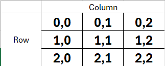
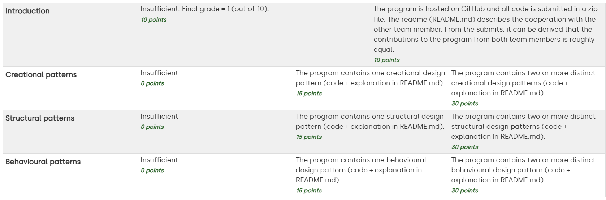

# SDE-Project-NL
## GitHub
https://github.com/Okidokie98/SDE-Project-NL

## Authors
- Brandon de Baat ([baat0004@hz.nl](baat0004@hz.nl) - 00073578)
- Dirk van Dijke ([dijk0166@hz.nl](dijk0166@hz.nl) - 00096502)

## Gebruik van de app
Om de app te starten ga je naar de TicTacToe.java class en klik je op het groene pijltje.
De console zal dan worden opgestart.

De speler wordt gevraagd om een rij en een kolom toe te voegen, de locaties van elke plek staan hieronder weergegeven.

1. Typ je nummer en druk [enter]
2. Typ je kolom en druk [enter]
3. Je zet wordt nu weergegeven, de AI zal gelijk zijn/haar zet maken.

Zie hieronder een plaatje voor de mogelijke locaties.

## Over onze app
Met ons project gaan wij een console versie van tic-tac-toe maken.

In de app zit één speler (zelf) en een AI-speler, dit is je tegenstander.
Op dit moment is er maar één niveau voor de AI.

Wij hebben voornamelijk gewerkt op één laptop, duo-programming, omdat dit voor ons makkelijker werkte.
Hierdoor kan het zijn dat de een meer commits heeft dan de ander in GitHub.

## Design Patterns
Dit project bevat meerdere 'design patterns', er zitten minimaal 3 verschillende types in:
1. Creational patterns
2. Structural patterns
3. Behavioural patterns
   
<small>(Klik op de dropdown's om meer informatie te zien)</small>
### Creational patterns

Factory Method

Dit patroon is te vinden in:
- Player
  - AIPlayer
  - HumanPlayer
- PlayerFactory
  - AIPlayerFactory
  - HumanPlayerFactory

Als creational pattern zal onze app de [Factory Method](https://refactoring.guru/design-patterns/factory-method) gebruiken.
Deze wordt gebruikt om de spelers te bouwen, wij willen als standaard 2 spelers gebruiken,
maar door dit design patroon kunnen we in de toekomst meerdere spelers toevoegen.

Een speler heeft een icoon, dit kan een kruisje ("X") of een cirkel ("O") zijn.
(Deze kan je zelf aanpassen in de TicTacToe main class)

Het patroon werkt met een interface genaamd "Player" met een getSymbol en een MakeMove functie.
Hieronder zijn twee factories verbonden, de Player Factory en de AI Factory. Deze hebben dezelfde functies als de interface,
maar kunnen elk de function overriden.

Singleton

Dit patroon is te vinden in:
- ScoreTracker

Deze class wordt gebruikt om de score van een spel bij te houden.
Hierdoor kan je meerdere spellen spelen en de score bijhouden.

Bij het starten van de code wordt éénmalig dit scoreboard aangeroepen, je kan oneindig
blijven spelen totdat je stopt. Bij het opnieuw opstarten van de code zal het scoreboard
weer op 0 staan.

Dit design pattern is handig omdat je maar één ding aanroept, het is niet afhankelijk van andere
classen.

### Structural patterns

Composite

  
Als structural pattern zal onze app de [Composite](https://refactoring.guru/design-patterns/composite) methode gebruiken.

Dit patroon is te vinden in:
- BoardComponent
- Board
- Cell

Deze wordt gebruikt om het bord te genereren.
Het BoardComponent heeft 2 funcites, render() en isEmpty().
Met deze fucntie wordt het juiste icoon geplaatst op de aangegeven plek, dit kan dus een X, O of _ zijn als het vakje leeg is.

Het bord bestaat uit 9 verschillende "cellen" (Cell.java), de isEmpty() kijkt of een vakje leeg ("_") is.
Als die leeg is dan kan er een symbool geplaatst worden, anders niet. 

Je zou het bord kunnen zien als één object met verschillende cellen er in.
Hierdoor zou je meerdere verschillende borden kunnen maken, in de toekomst zou je dan een 3D Tic-Tac-Toe kunnen maken
waarbij elke winst in een apart bord je een symbool oplevert op het Groote bord (die bestaat uit 9 kleine borden).

### Behavioural patterns

Command

Als behavioural pattern zal onze app de [Command](https://refactoring.guru/design-patterns/command) methode gebruiken.

Dit patroon is te vinden in:
- Command
- GameController

De Command Class heeft één functie, genaamd "Execute", deze wordt geactiveerd zodra de speler de coordinate
heeft aangegeven. Deze zal het commando "MakeMove" aansturen en dit commando toevoegen aan de GameController.
Hierin staat een lijst met alle gemaakte moves, hierdoor wordt er een overzicht gehouden van alle zetten.

In de toekomst zouden we dan eventueel een "oplsaan" functie kunnen toevoegen omdat de historie van het spel is onthouden.

## Grading Form

